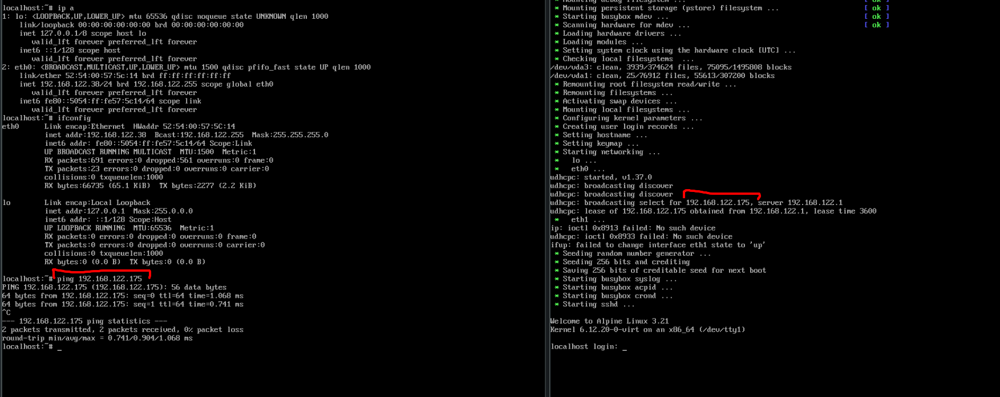
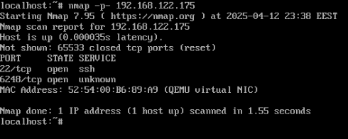
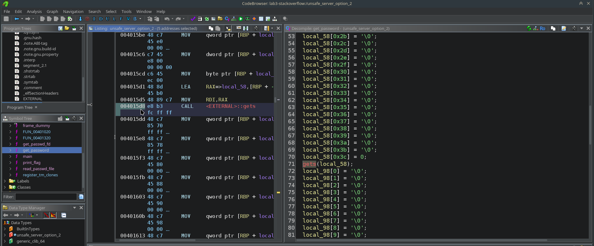
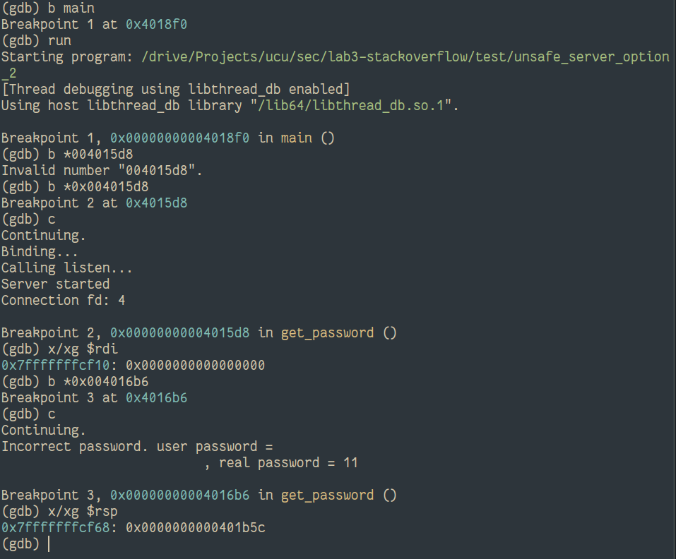
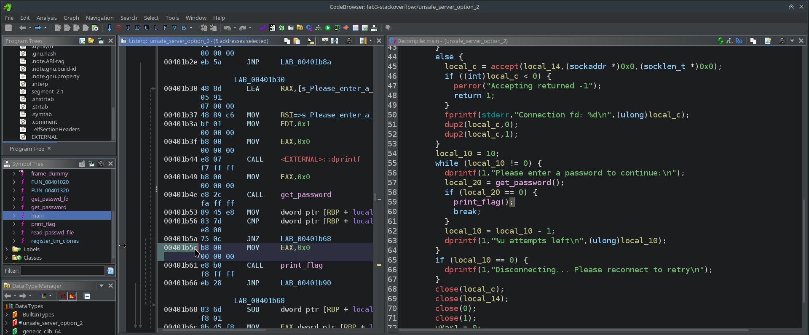
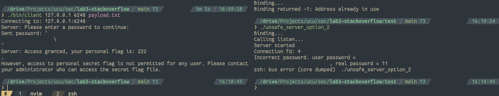
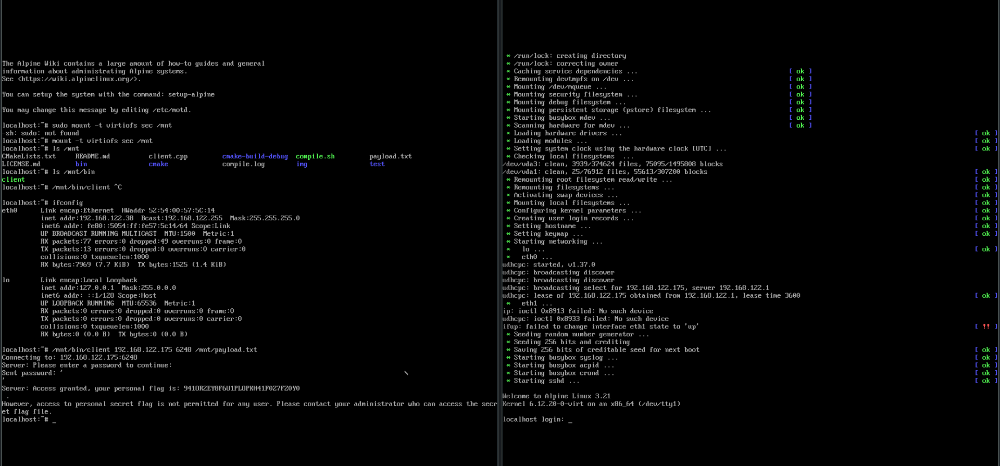

**I'm Radomyr Husiev - thus variant 2**

IP address of:
- attacker - 192.168.122.38
- target - 192.168.122.175

Here is the `ifconfig` confirming it:



But there is a problem: a task says to add the result of `ifconfig` from the target as well, but we don't have access to its shell (unless we do the additional task, of course)! Therefore, I can't provide it, sadly

The port of target is 6248:



and it is open under tcp. All other (except 22) are closed (or at least somehow hidden)

The `gets` waits until `\n` before finishing. So it will disregard the end of the buffer it is writing to (it physically can't know, where is the end), and we can write past the end of the buffer, including overriding the return address. So we want to override the return address to point to printing the successful message

First, we want to know, how many more bytes than the size of input buffer, we need to override, in order to override return address. Here we can see the address, where `gets` is called (to input the user's password) by looking at the disassembly (I use ghidra, because why not):



We will set a breakpoint to this address in gdb in order to see, what buffer address is given to it (the first argument is `RDI` - so we print the address stored in it). When we know the address of the buffer, we need to know the address of where the return address is stored on the stack - so we will set the breakpoint to the end of the function and read `RSP` (where the stack pointer is right before `RET` is called). Here are the steps to get these two addresses:



So,
- password buf: 0x7fffffffcf10
- stack frame start (return address location): 0x7fffffffcf68

That means we need to write $0x7fffffffcf68 - 0x7fffffffcf10 = 0x58 = 88$ bytes of anything, and then 8 bytes (on 64 bit systems, like ours) of the address we want to jump to

Next, let's see where we want to forcefully jump (we want to print the flag):



So the address is 0x0000000000401b5c

In my case I write 88 symbols of `' '`, and then (because I hate endiannesses):

```cpp
*(reinterpret_cast<size_t *>(payload.get() + 88)) = 0x00401b5c;
```

Next, we will add a `\n` symbol in order for `gets` to finish and `\0` just in case, so that no strings get broken on the client side. The payload you can input into my client is located at  (`2020 2020 2020 2020 2020 2020 2020 2020 2020 2020 2020 2020 1b5c 0040 0000 0000` in hex)

The rest of the tcp client is heavily based on [my tcp server-client](https://github.com/rhusiev-student/s5_os_tcp) I used during the OS course

To use it:

```sh
./compile.sh -d # for debug, or `./compile.sh -o` for optimized (release)

./bin/client <ip> <port> <payload_file>
# or
./bin/client <ip> <port> # for default payload
# or
./bin/client # for localhost:6248
```

Let's test on the local system:



Yay, let's now just move the code to the alpine linux and run (but with a different IP):



The flag can be found at  (I rewrote it manually from the image, because I was too lazy to pass it to host after I turned the VM off. It should be correct, but in case of doubt see the image above)
